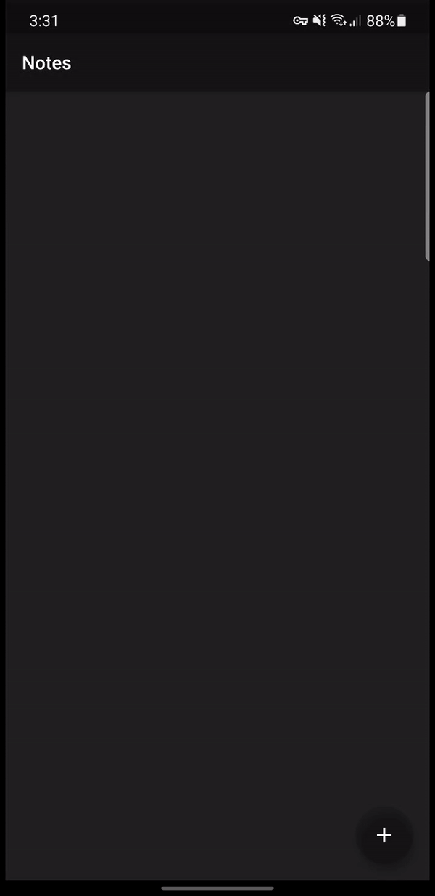

# noteKeeper

A Flutter note taking application built with flutter that utilizes SQlite and taches CRUD operation from SQlite database.

# App Demo

For help getting started with Flutter, view our
[online documentation](https://flutter.dev/docs), which offers tutorials,
samples, guidance on mobile development, and a full API reference.
